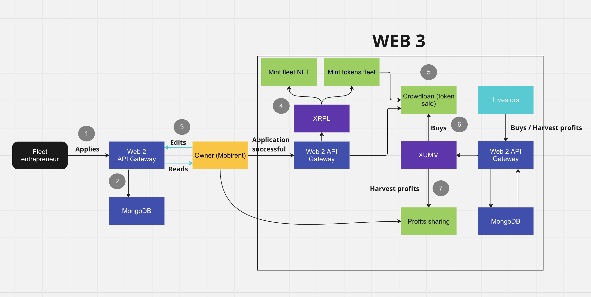

## Available Scripts

In the project directory, you can run:

### `npm run start:dev`

This will run the express server in watch mode (watching over all the server folder)

### What does this server do ?

By communicating with this server through HTTP requests, both the administrators and the users of Mobirent
will interract with the XRPL ledger (no safeguarding have been implemented yet on the endpoints).

This app is very hybrid, using web2 and XRPL tech stacks : it's leveraging the XRP Ledger
by using both XUMM and classic web2 tools such as MongoDB (of course the usage of MongoDB
could be replaced by smart contracts deployed over the EVM sidechain).

### Workflow ?

1-2-3) An entrepreneur is looking for funding in order to set up his fleet. He will apply through
our web-app, we will save his application into our database (mongo) and from an admin interface (to be developed)
applications are processed.

4) Once an application is successfull and all the terms have been agreed upon, a NFT which represents the fleet
is being minted. The metadata of this NFT do contain : the expected profitability of the fleet, the company informations,
the name/ticker of the token that will be issued to tokenize the fleet company. Of course a nice JPG will also 
be there to have a beautiful representation of the fleet that can be displayed on the web client side.

A token is also issued, token representating a share of the company. 

5-6) Those tokens are offered for sale. The piece of code in charge of doing this is contained in the TransactionService.ts 
file, more precisely in the buyTokens method that is called upon sending a buyOrder to the '/buyTokens' route end-point.
A "reetrancy guard" has been put in place in order to prevent buyers from submitting several buy transactions
by taking advantage from the fact that MongoDB may no be updated regarding their current participation. This
is an easy way to prevent users from exceeding the max cap / user. 

7) Not done yet : users are harvesting the profits of their investment (their share of the token supply 
allow them to harvest the corresponding share of the company profits). To be done by using regular random snapshots
to capture users supply %, save them into mongoDB, and sending automatically the XRP accordingly to the users wallets 
once 30 snapshots have been done.